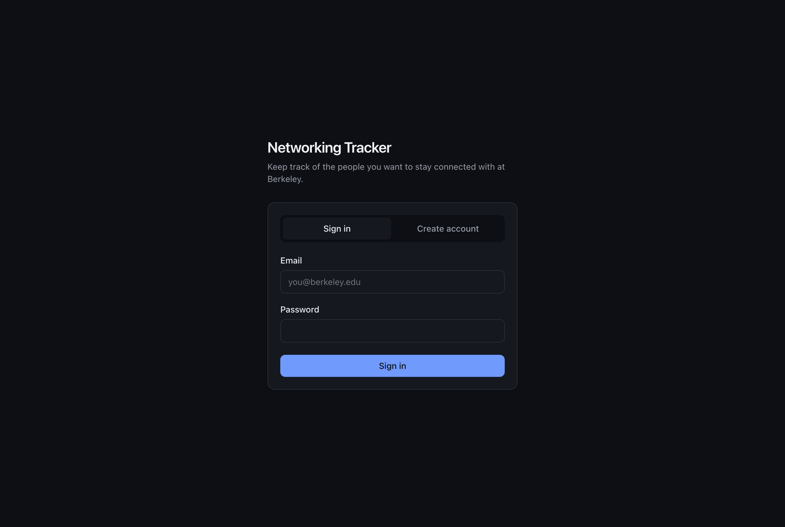
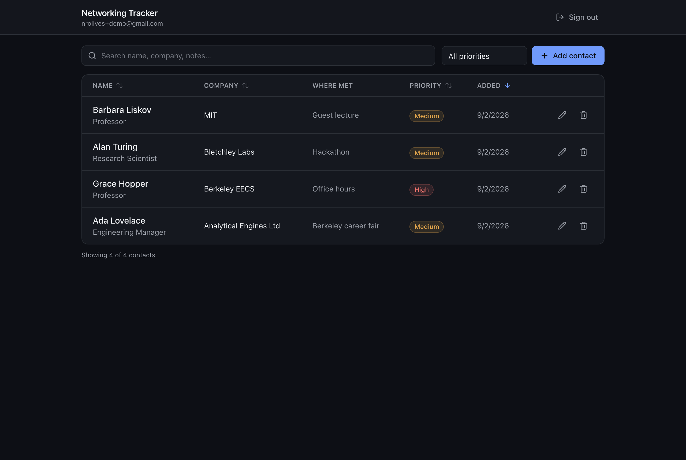
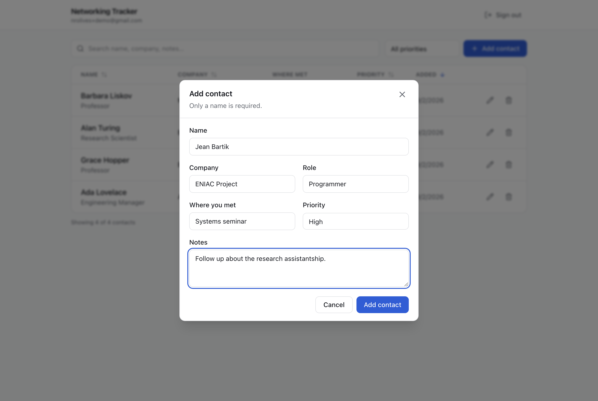
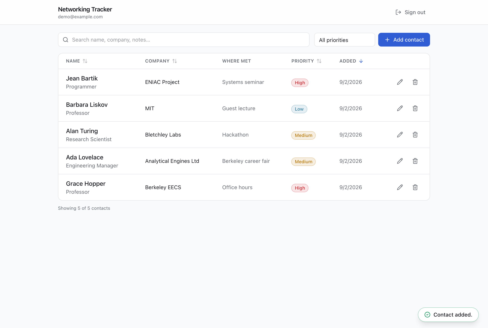
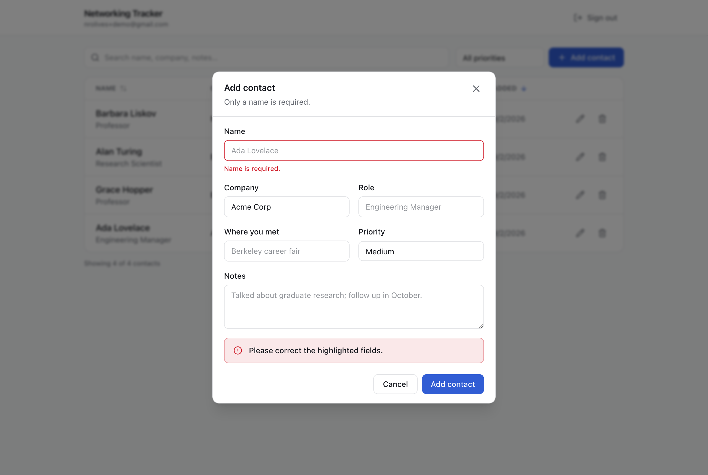
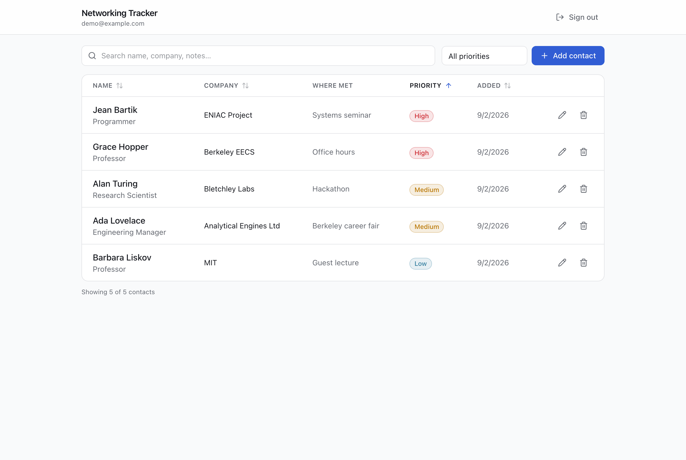
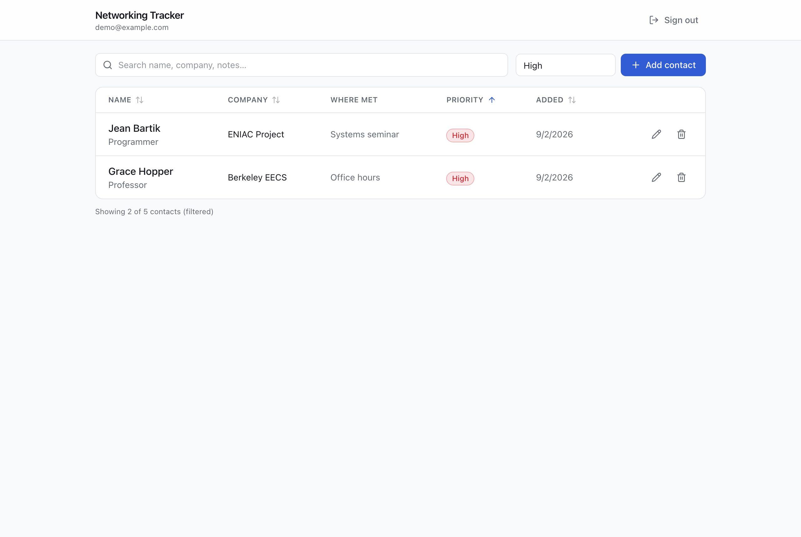
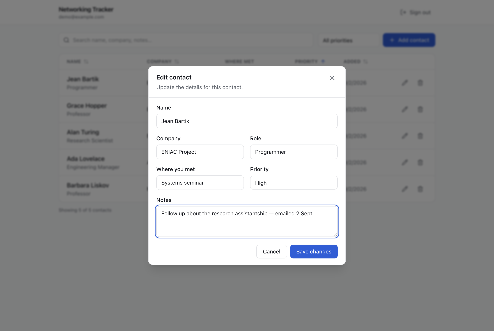
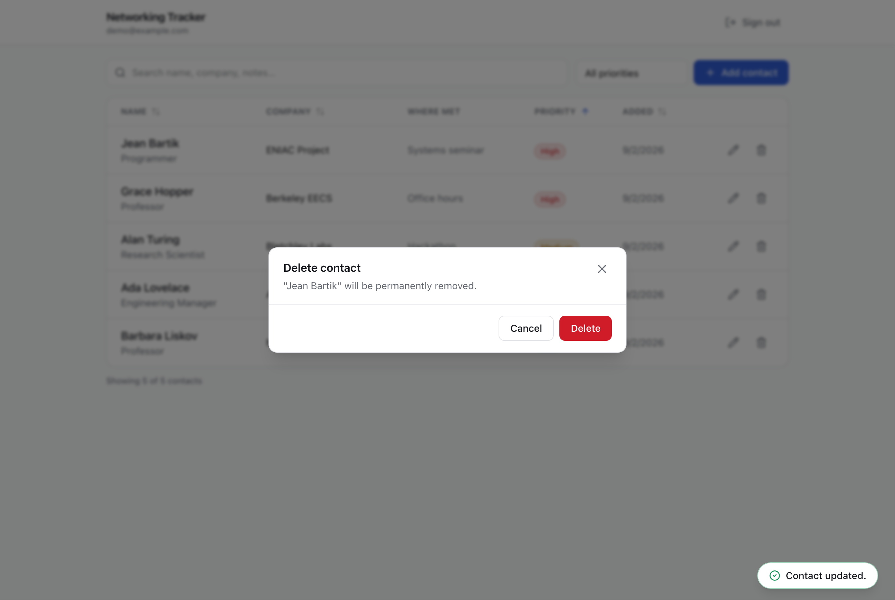
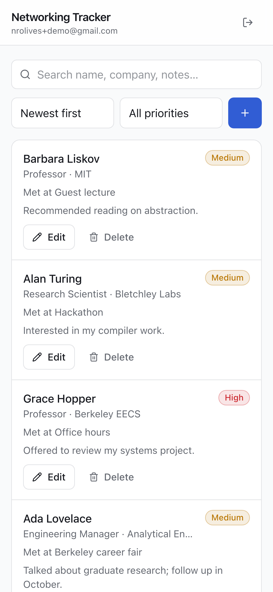

# Networking Tracker

A private contact tracker for the people you want to stay connected with at Berkeley. Each contact
belongs to exactly one account, and that ownership is enforced by PostgreSQL Row Level Security
rather than by application code — so a bug in the API, or a request that bypasses the API entirely,
still cannot expose one user's contacts to another.

**Live app: https://networkingtracker.vercel.app**
**Repository: https://github.com/nolives/networkingtracker**

---

## Contents

- [Features](#features)
- [Screenshots](#screenshots)
- [Technology stack and why](#technology-stack-and-why)
- [Architecture](#architecture)
- [Local setup](#local-setup)
- [Environment variables](#environment-variables)
- [Database schema](#database-schema)
- [Authentication and RLS ownership](#authentication-and-rls-ownership)
- [Testing](#testing)
- [Grading evidence](#grading-evidence)
- [Deployment](#deployment)
- [Known limitations](#known-limitations-and-what-id-do-next)

---

## Features

- Email and password sign-up, sign-in, and sign-out via Neon Managed Better Auth
- A private contact list per account — name, company, role, where you met, notes, and priority
- Create, edit, and delete contacts, with a confirmation step before deleting
- Sort by name, company, priority, or date added; filter by priority; search across every field
- Contacts persist in Neon Postgres and survive a refresh
- Distinct loading, empty, filtered-empty, success, and error states
- Responsive: a table on desktop, cards on mobile, with 44px touch targets and a mobile sort control
- Light and dark themes, following the operating system
- Validation in two independent layers — the API rejects bad input, and the database's own CHECK
  constraints reject it again

## Screenshots

Captured from the live deployment by `scripts/` automation, not by hand.

### Sign in


### Contact list, sortable and filterable


### Creating a contact



### Invalid input fails safely
An empty name is rejected by the **backend**, and the per-field message is rendered inline. The
browser's own validation is disabled (`noValidate`) so the request actually reaches the server and
shows the server's real error rather than a native tooltip.



### Sorting and filtering
Sorted by priority — note the order is by urgency (high → medium → low), not alphabetical.




### Editing and deleting



### Data survives a refresh
After a full page reload, the list is re-fetched from Neon Postgres.


### Mobile
The six-column table becomes cards, and a sort control appears because the sortable column headers
are hidden at this width.



## Technology stack and why

| Layer | Choice | Why |
|---|---|---|
| Frontend | React 19 + Vite + TypeScript | Fast builds and instant HMR; React was a project requirement |
| Styling | Tailwind CSS v4 + shadcn/ui patterns | Component source lives in this repo, so every line is ours to explain; responsive layout without a separate stylesheet |
| Backend | Node + Express 5 + TypeScript | A genuinely separate service with its own package, dependencies, and tests |
| Validation | Zod | One schema defines the API contract and is what the unit tests exercise |
| Auth | Neon Managed Better Auth | Issues the JWT whose `sub` claim drives RLS |
| Data access | Neon Data API (PostgREST) | Lets the backend query *as the signed-in user*, so RLS applies to every request |
| Database | Neon Postgres 18 | RLS is the security model this project is built around |
| Hosting | Vercel Services | Builds the frontend and backend separately, serves both from one domain |

## Architecture

```
Browser — React + @neondatabase/neon-js
   │
   │  1. sign up / sign in / sign out
   ├──────────────────────────────────────────►  Neon Managed Better Auth
   │                                                • opaque session cookie
   │  2. GET /token → JWT whose `sub` is the         • JWT for API access
   │     user id
   │
   │  3. fetch /api/contacts
   │     Authorization: Bearer <JWT>
   ▼
Express backend  (Vercel service)
   │
   │  4. verify the JWT signature against Neon's JWKS  ──►  ${AUTH_URL}/.well-known/jwks.json
   │     invalid or expired  →  401
   │
   │  5. validate the body with Zod
   │     empty name or bad priority  →  400 with per-field messages
   │
   │  6. forward THE SAME USER'S JWT to the Data API
   ▼
Neon Data API (PostgREST)
   │
   ▼
Neon Postgres
     RLS policies compare auth.user_id() — the JWT's `sub` — to each row's user_id.
     The database decides which rows exist for this request.
```

### How the frontend and backend stay separate

`frontend/` and `backend/` are separate npm workspaces with their own `package.json`, dependencies,
and TypeScript configuration. They share no code and communicate only over HTTP + JSON with a Bearer
token.

The frontend contains no SQL, no database driver, and makes no Data API calls for contact data. The
backend contains no UI and runs as an ordinary Express server (`npm run dev:backend`) with no Vercel
involvement. In production, `vercel.json` declares them as two independently built
[Vercel Services](https://vercel.com/docs/services) sharing one domain, with `/api/*` routed to the
backend and everything else to the frontend.

### Why the backend forwards the user's token instead of using DATABASE_URL

The conventional way to build a Node backend is to connect with `DATABASE_URL` and write
`WHERE user_id = $1`. This project deliberately does not. Under that design the database would
happily return any row, and the only thing standing between one user and another's data would be a
`WHERE` clause — one forgotten filter away from a breach, with the RLS policies reduced to decoration.

Instead the backend holds **no database credentials at all**. It forwards the caller's own JWT to the
Data API, so every query runs with that user's identity and Postgres itself filters the rows.
`DATABASE_URL` is used only by the local migration script and is deliberately **not** configured in
Vercel.

The practical consequence: an attacker who skips the backend entirely and calls the public Data API
directly with a valid token still cannot read anyone else's contacts. `npm run test:rls` demonstrates
exactly that.

## Local setup

Requires Node 20+.

```bash
git clone https://github.com/nolives/networkingtracker.git
cd networkingtracker
npm install
```

Create a Neon project with Managed Better Auth and the Data API enabled:

```bash
npx neon@latest auth
npx neon@latest projects create --name networking-tracker
npx neon@latest neon-auth enable --project-id <project-id>
npx neon@latest data-api create --project-id <project-id> --branch <branch-id> \
  --database neondb --auth-provider neon_auth --add-default-grants
```

Then configure and migrate:

```bash
cp .env.example .env.local    # fill in the real values
npm run db:migrate            # applies db/schema.sql
```

Run both services — the frontend proxies `/api` to the backend, mirroring production:

```bash
npm run dev
```

- Frontend: http://localhost:5173
- Backend: http://localhost:3001

To run them separately: `npm run dev:frontend` and `npm run dev:backend`.

## Environment variables

Copy `.env.example` to `.env.local`. That file is gitignored and no real value is committed.

The assignment lists the public variables with Next.js's `NEXT_PUBLIC_` prefix. This frontend is
React + Vite, where only `VITE_`-prefixed variables reach the browser, so the names differ while the
values and their public/server-only split are exactly as specified:

| Assignment name | Used here | Exposure |
|---|---|---|
| `NEXT_PUBLIC_NEON_AUTH_URL` | `VITE_NEON_AUTH_URL` | Public — in the browser bundle |
| `NEXT_PUBLIC_NEON_DATA_API_URL` | `VITE_NEON_DATA_API_URL` | Public — see note below |
| — | `NEON_AUTH_URL` | Server-only — JWKS verification |
| — | `NEON_DATA_API_URL` | Server-only — backend → PostgREST |
| `DATABASE_URL` | `DATABASE_URL` | **Secret. Local migrations only; never set in Vercel** |

In Vercel the two public URLs are stored as `Config` variables and the two server URLs as `Secret`
variables. `DATABASE_URL` is not present in the Vercel project at all.

**On `VITE_NEON_DATA_API_URL`.** Because a Node backend sits between the browser and the database,
the browser never queries the Data API — it needs only the Auth URL. The variable is declared for
parity with the assignment's list, and `scripts/rls-two-user-test.mjs` points a real user's real
token at that exact public URL to prove RLS holds even when the endpoint is known. The assignment
says the frontend *may* use the public Data API URL; the binding requirement is that RLS protects
every exposed row, which this design satisfies more strictly by exposing fewer rows to the client at
all.

## Database schema

`db/schema.sql` is the single source of truth. Every column of the `contacts` table:

| Column | Type | Constraints | Notes |
|---|---|---|---|
| `id` | `uuid` | primary key, `default gen_random_uuid()` | |
| `user_id` | `text` | **`not null`, `default auth.user_id()`** | Owner. Filled from the JWT, never from client input |
| `name` | `text` | `not null`, `check (length(btrim(name)) > 0)` | Rejects `''` and whitespace-only |
| `company` | `text` | nullable | |
| `role` | `text` | nullable | |
| `where_met` | `text` | nullable | |
| `notes` | `text` | nullable | |
| `priority` | `text` | `not null`, `default 'medium'`, `check (priority in ('high','medium','low'))` | |
| `created_at` | `timestamptz` | `not null default now()` | |
| `updated_at` | `timestamptz` | `not null default now()` | Set by the API on edit |

Indexed on `(user_id, created_at desc)` to match the default listing.

Verified output from `npm run db:migrate`:

```
RLS enabled on contacts: true
Policies (4):
  - contacts_delete_own    DELETE
  - contacts_insert_own    INSERT
  - contacts_select_own    SELECT
  - contacts_update_own    UPDATE

Columns:
  - id           uuid                       NOT NULL default gen_random_uuid()
  - user_id      text                       NOT NULL default auth.user_id()
  - name         text                       NOT NULL
  - company      text                       NULL
  - role         text                       NULL
  - where_met    text                       NULL
  - notes        text                       NULL
  - priority     text                       NOT NULL default 'medium'::text
  - created_at   timestamp with time zone   NOT NULL default now()
  - updated_at   timestamp with time zone   NOT NULL default now()
```

## Authentication and RLS ownership

**The request flow.** A user signs in against Managed Better Auth. The session it returns holds an
*opaque* 32-character session token; the JWT the Data API accepts comes from `GET {AUTH_URL}/token`.
The browser sends that JWT to the Express backend, which verifies its signature against Neon's JWKS
endpoint (EdDSA/Ed25519) before doing anything else, then forwards the same token to the Data API so
the query reaches Postgres carrying the user's identity.

**The ownership rule.** `auth.user_id()` returns the JWT's `sub` claim as text. Every policy on
`contacts` compares it to the row's `user_id`:

```sql
alter table contacts enable row level security;

create policy contacts_select_own on contacts
  for select to authenticated using (auth.user_id() = user_id);

create policy contacts_insert_own on contacts
  for insert to authenticated with check (auth.user_id() = user_id);

create policy contacts_update_own on contacts
  for update to authenticated
  using (auth.user_id() = user_id)
  with check (auth.user_id() = user_id);

create policy contacts_delete_own on contacts
  for delete to authenticated using (auth.user_id() = user_id);
```

Four separate policies, one per operation, rather than a single `FOR ALL`.

**Why `USING` and `WITH CHECK` are both present on update.** `USING` decides which existing rows an
`UPDATE` may target — it stops a user editing someone else's row. `WITH CHECK` re-tests the row
*after* modification, which is what stops a user rewriting `user_id` to hand their own row to another
account. Without it, ownership could be transferred; with it, such an update matches zero rows. The
privacy test exercises this case specifically.

**Ownership cannot be supplied by the client.** `user_id` appears in no Zod schema, so the backend
strips it from any request body before the database is touched. Ownership comes only from the
verified JWT via the column default. Three automated tests cover this.

**Signed-out callers get nothing.** `authenticated` holds the table grants; `anonymous` is explicitly
revoked.

## Testing

```bash
npm test
```

19 Vitest cases against the validation layer. They need no network, database, or credentials, so they
pass on a fresh clone.

```
 RUN  v3.2.7 /Users/nickolives/code/networkingtracker/backend

 ✓ src/validation.test.ts (19 tests) 3ms

 Test Files  1 passed (1)
      Tests  19 passed (19)
   Duration  211ms
```

<details>
<summary>All 19 cases</summary>

```
✓ createContactSchema — name is required > rejects an empty name
✓ createContactSchema — name is required > rejects a whitespace-only name
✓ createContactSchema — name is required > rejects a missing name
✓ createContactSchema — name is required > rejects a name longer than 200 characters
✓ createContactSchema — name is required > trims surrounding whitespace from a valid name
✓ createContactSchema — priority is constrained > accepts high
✓ createContactSchema — priority is constrained > accepts medium
✓ createContactSchema — priority is constrained > accepts low
✓ createContactSchema — priority is constrained > rejects a priority outside the allowed set
✓ createContactSchema — priority is constrained > rejects a priority with the wrong casing
✓ createContactSchema — priority is constrained > defaults to 'medium' when omitted
✓ ownership cannot be supplied by the client > strips a user_id smuggled into a create payload
✓ ownership cannot be supplied by the client > strips a user_id smuggled into an update payload
✓ ownership cannot be supplied by the client > strips an id, so a row cannot be re-pointed
✓ updateContactSchema — partial but still validated > accepts a single valid field
✓ updateContactSchema — partial but still validated > still rejects an empty name on edit
✓ updateContactSchema — partial but still validated > still rejects an invalid priority on edit
✓ updateContactSchema — partial but still validated > rejects an empty payload
✓ optional fields normalise to null > converts empty strings to null rather than storing ""
```

</details>

### Two-account privacy test

```bash
npm run test:rls                                        # against localhost
TEST_API_URL=https://networkingtracker.vercel.app \
TEST_ORIGIN=https://networkingtracker.vercel.app \
  npm run test:rls                                      # against production
```

Requires `.env.local` with two real test accounts. It signs in as both, has User B create a contact,
then has User A attempt to read, modify, reassign, and delete it — **both through the backend and
directly against the public Data API** — before confirming with User B that the row is untouched.

Both write attempts send `Prefer: return=representation`, because PostgREST answers a write that
matched zero rows with a bare `204` that would otherwise be indistinguishable from success. Asserting
on status alone would have reported a successful cross-user delete.

## Grading evidence

### Automated test passing

See [Testing](#testing) above — 19/19 passing, no credentials required.

### Two accounts, run against the live deployment

```
Two-account RLS privacy test
==========================================================

User A: usera@example.com  (sub 601c0e1b-9019-4449-9dab-69d20dab16b5)
User B: userb@example.com  (sub dd31b3ed-0a5d-4f8a-ae20-b0eb2f2ed147)
  PASS  the two accounts are distinct

User B created contact 83acb05c-f894-4058-b49e-defba68dedb1
  PASS  the row is owned by User B via auth.user_id()

1. User A attacks the public Data API directly (no backend):
  PASS  SELECT returns none of User B's rows
  PASS  every row User A can see is their own
  PASS  SELECT by exact id returns nothing
  PASS  UPDATE affects zero rows
  PASS  UPDATE cannot reassign ownership (WITH CHECK)
  PASS  DELETE affects zero rows

2. User A attacks through the backend API (https://networkingtracker.vercel.app):
  PASS  GET /contacts excludes User B's rows
  PASS  GET by id returns 404
  PASS  PATCH returns 404
  PASS  DELETE returns 404

3. User B re-reads their contact:
  PASS  the contact still exists
  PASS  its name was not modified
  PASS  it is still owned by User B

==========================================================
15 passed, 0 failed

User A cannot read, modify, or delete User B's contacts.
```

Section 1 is the meaningful one: User A holds a valid token and the public Data API URL, bypasses the
backend completely, and still gets nothing. That is RLS doing the work, not application code.

### Sign-in and sign-out

See [screenshot 01](docs/screenshots/01-sign-in.png) (signed out) and
[screenshot 02](docs/screenshots/02-contact-list.png) (signed in, with the Sign out control in the
header).

### Create, edit, delete, and refresh

Screenshots [03](docs/screenshots/03-add-contact.png), [04](docs/screenshots/04-created.png),
[08](docs/screenshots/08-edit-contact.png), [09](docs/screenshots/09-delete-confirm.png), and
[10](docs/screenshots/10-after-refresh.png).

### Invalid input failing safely

[Screenshot 05](docs/screenshots/05-invalid-input.png) — an empty name rejected by the backend with an
inline message and no row written.

### No committed secrets

`.gitignore` excludes every `.env` variant except `.env.example`. Verified across the full history:

```
$ git ls-files | grep -E '\.env'
.env.example                          # the only .env file tracked, placeholders only

# Connection strings carrying real credentials.
# `grep -v user:password` excludes the placeholder in .env.example, which is
# the one connection string that is supposed to be committed:
$ git log -p --all | grep -E 'postgres(ql)?://[a-z_]+:[^@]{8,}@' | grep -vc 'user:password'
0
# Neon role passwords (the prefix followed by an actual secret):
$ git log -p --all | grep -cE 'npg_[A-Za-z0-9]{12,}'
0
# JWTs:
$ git log -p --all | grep -cE 'eyJ[A-Za-z0-9_-]{10,}\.eyJ'
0
```

The patterns are written to match a *credential* rather than a bare prefix, so this section does not
match itself and the counts stay honest when you re-run them.

## Deployment

Deployed to Vercel as a single project containing two services.

```bash
vercel link --yes --project networkingtracker

# Public URLs — these reach the browser, so Vercel requires them to be
# declared explicitly as config rather than secrets.
vercel env add VITE_NEON_AUTH_URL     production --type config
vercel env add VITE_NEON_DATA_API_URL production --type config

# Server-only.
vercel env add NEON_AUTH_URL     production
vercel env add NEON_DATA_API_URL production

vercel deploy --prod
```

`DATABASE_URL` is intentionally **not** added — the deployed app never connects to Postgres directly.

Finally, the deployed domain must be a trusted origin for Neon Auth or sign-in will fail there:

```bash
npx neon@latest neon-auth domain add https://networkingtracker.vercel.app \
  --project-id <project-id>
```

`vercel.json` declares the two services and the routing between them:

```json
{
  "services": {
    "frontend": { "root": "frontend/", "framework": "vite",
                  "buildCommand": "npm run build", "outputDirectory": "dist" },
    "backend":  { "root": "backend/", "framework": "express",
                  "buildCommand": "npm run build", "entrypoint": "dist/index.js" }
  },
  "rewrites": [
    { "source": "/api/(.*)", "destination": { "service": "backend" } },
    { "source": "/(.*)",     "destination": { "service": "frontend" } }
  ]
}
```

Services receive the original request path, so `/api/contacts` arrives at Express unchanged.

## Development notes

Bugs found by running the app end to end rather than by reading the code. Recorded here because
the git history was squashed to remove personal data from earlier screenshots.

1. **`.partial()` does not strip a Zod `.default()`.** `updateContactSchema` was derived from the
   create schema, so an empty `PATCH {}` parsed to `{ priority: 'medium' }`, slipped past the
   "no fields to update" guard, and silently reset the contact's priority. The update schema is now
   built from the shared field definitions with no default, and a test pins the behaviour.

2. **Vite loads `.env` files from its own root, not the repository root.** Every `VITE_*` variable
   was undefined, and the auth SDK quietly fell back to a relative `/api/auth` path that 404'd
   against our own origin — which looks like a broken backend, not missing configuration. Fixed with
   `envDir`, plus a startup check that throws instead of degrading silently.

3. **The session token is not the API token.** Managed Better Auth returns an opaque 32-character
   session token; the Data API needs the signed JWT from `GET {AUTH_URL}/token`. Neon's own backend
   guide reads `session.token`, which would forward the wrong value. The client now verifies that
   what it holds is actually a three-segment JWT before sending it.

4. **Sorting was unreachable on mobile.** The sort controls lived only in the desktop table header,
   which is hidden below `md`. Added a sort select for small screens.

5. **The light theme never applied.** Tailwind v4 hoists `@theme` out of media queries, so
   `@media (prefers-color-scheme: dark) { @theme { … } }` silently dropped the condition and the dark
   values won unconditionally. Dark overrides now redefine the custom properties in a plain `:root`
   block.

6. **Sign-out left the user looking signed in.** The session cleared server-side but the SDK's
   `useSession` hook did not invalidate, so the app kept rendering the contact list against a dead
   session. Sign-out now awaits the call and then navigates, which also drops the fetched contacts
   from memory.

7. **Deploying to Vercel took three attempts.** Compiled ESM was parsed as CommonJS until the build
   emitted a `{"type":"module"}` marker beside its output, and Vercel's Express integration resolves
   the entrypoint by filename convention — it kept selecting `dist/app.js` and rejecting it for
   having no default export.

Also worth noting: PostgREST answers a write that matched zero rows with a bare `204`, which is
indistinguishable from success. The two-account test would have reported that User A successfully
deleted User B's contact had it asserted on status codes alone.

## Known limitations and what I'd do next

- **`@neondatabase/neon-js` is a beta** (`0.7.0-beta`), the only published version. Its API may change.
- **Bundle size.** The frontend is ~640 kB uncompressed (~178 kB gzipped), most of it the auth SDK.
  Route-level code splitting would trim it; there is only one route today, so it was not worth doing.
- **Client-side sort and filter.** Both run in the browser over the full contact list. Correct and
  instant at personal-address-book scale, but thousands of contacts would need server-side paging.
- **No end-to-end browser test.** CRUD flows were verified manually and through the screenshot
  automation, but there is no committed Playwright suite. That is the first thing I would add.
- **The backend makes one Data API round trip per request.** Fine at this scale; a busier app would
  want connection reuse or caching of the JWKS response beyond the SDK's default.
- **Deleting is permanent** — no soft delete or undo.
- **Session lifetime is whatever the auth SDK defaults to.** There is no "remember this device"
  control, and an expired token surfaces as a sign-in prompt.
